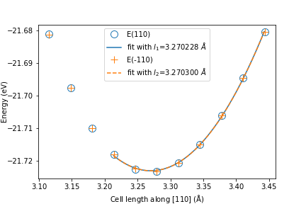
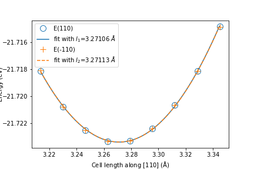

# Mn2Au magneto-elastic 110 properties assessed by VASP calculations

## Method summary:

The main workflow and computational approach was taken from this [paper](https://arxiv.org/abs/2009.01638). VASP is an implementation of PerdewBurke-Ernzerhof (PBE) version of the Generalized Gradient Approximation (GGA). In short, we start with optimising the cell shape by minimising the stress with subsequent minimisation of the forces to the threshold value of 0.001 ev/Angstrom. For this calculations collinear VASP calculations with Methfessel-Paxton smearing scheme is used (ISMEAR=1) with sigma value of 0.1 eV. The minimised cell has the Bulk Centered Tetragonal structure with the following parameters: a = 3.279294 Angstrom and c = 8.430871 Angstroms.
For magnetic anisotropy calculations I followed the recommended procedure. First collinear spin-polarized job without Spin-Orbit Coupling (SOC) is performed to calculate the wavefunction and charge density, and then a second non-collinear spin-polarized job is performed in a non-self-consistent manner, by switching on the SOC, reading the wavefunction and charge density generated in the collinear job, and defining the spin orientation through the quantisation axis (SAXIS-tag). The number of bands included in the non-collinear job is set twice as large as the number of bands in the collinear job. For this calculations I used tetrrahedron method with Blöchl corrections for smearing (ISMEAR=-5). The energy convergence criterion of the electronic self-consistency was chosen as $10^{−9}$ eV/cell.
For all calculations k-points grid was 25x25x25 and was chosen to have the error of the total energy smaller than 5 $\mathrm{\mu eV}$. The energy cutoff was set to be 600 eV (almost 3 times larger than the default value).

## Results:
#### Elastic constants in GPa
| $C_{11}$      | $C_{12}$    | $C_{13}$  | $C_{33}$     |  $C_{44}$  | $C_{66}$     |
| :---------:   | :--------:  | :-------: | :-------:    | :-------:  | :-------:    |
| 138 $\pm$ 5   | 126 $\pm$ 3 | 75 $\pm$ 2| 232  $\pm$ 9 |82  $\pm$ 4 | 110  $\pm$ 3 |

#### Magnetic anisotropy
The energy difference for the configurations with spin oriented along z direction E(001) and along [110] direction E(110) was found to be 2.55 meV and is in excellent agreement with [paper](https://journals.aps.org/prb/abstract/10.1103/PhysRevB.81.212409). The difference within in-plane configurations of E(100) and E(110) was found to be equal to ~ 4 $\mathrm{\mu eV}$ within the expected error of the current settings. *If we really need this number it will require more expensive calculations, but the bottom line is that the in plane anisotropy is low*

#### Magnetostriction a for strains along <110> directions

Here I plot the energy difference between configuration with spins oriented along [-110] direction E(-110) and [110] direction E(110) for two cases of strains along [110] and [-110]. Positive values of $\mathrm{\Delta E= E(-110) - E(110)} $ indicates that configurations with spin oriented along [110] directions are more stable, negative value - configurations with [-110] are more stable.

It can be seen that in both cases in the tensile region the configurations with spins oriented perpendicular to the strain directions are more favourable. Liner fit gives the values of B=-1.3x$\mathrm{10^{-3}}$ eV per unit of strain (not percent here, but just ratio) per percent of strain it will be -0.013 meV/%.

**Calculations for strain $\pm$ 0.02**

The results give B=-0.92 $\pm$ 0.05 meV per f.u.

#### Magnetostrictive coefficients

By fitting a quadratic function to the function of energy from the length of the cell it is possible to identify the equilibrium cell lengths for the configurations with different spin orientations. Then the magnetostrictive coefficient $\lambda$ can be calculated as $ \lambda = \frac{2 (l_1 - l_2)}{l_1+l_2}$. Example of the plot of the curves and the fit is shown below. The calculated value of the magnetostrictive coefficient was found to be $\mathrm{\lambda^{\sigma, 2}=-21.85 x 10^{-6}}$

**Calculations for strain $\pm$ 0.02**

$\mathrm{\lambda^{\sigma, 2}=-23.38 x 10^{-6}}$

#### Magnetoelastic coefficient $b_3$
[Paper](https://arxiv.org/abs/2009.01638) gives the following relation:

$b_3 = - 2 C_{66} \lambda^{\sigma, 2}$, thus we get $b_3$ = 4.8 MPa.

#### Convergence tests

- K-points on energy used for MAE:

- K-points and energy cut off convergence on used for cell relaxation
    - forces

    - stress

